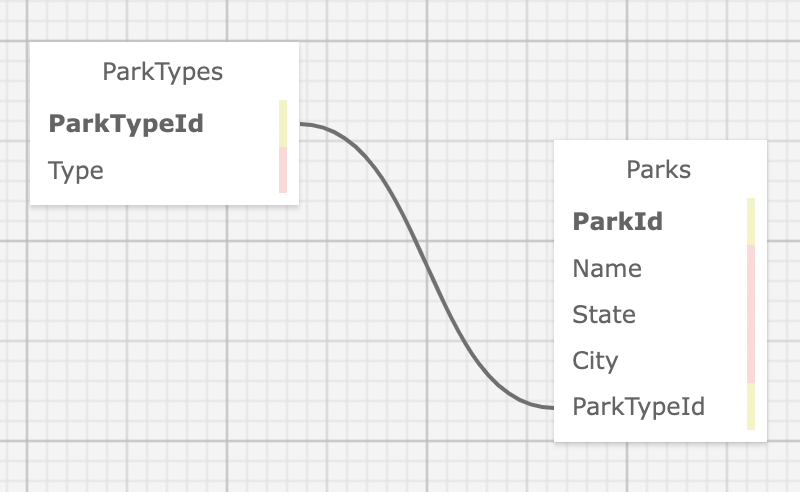

<!--  -->
# Parks Lookup API 
### An API for state and national parks
#### By Kirsten Opstad 

***
## Table of Contents
* [Technologies](#technologies)
* [Description](#description)
* [Objectives](#objectives)
* [Setup Instructions](#setup-installation-requirements)
* [API Documentation](#api-documentation)
* [License](#license)
***

## Technologies Used

* C#
* .Net 6
* ASP.Net Core 6 MVC
* EF Core 6
* SQL
* MySQL
* LINQ
* Swagger

***
## Description

A student project demonstrating knowledge of building RESTful APIs. This is an API is a __Parks Lookup__: an API for state and national parks. The API will list state and national parks.

***
## Objectives
### Goals
1. Meet MVP
2. [Stretch] Add functionality to call on NPS API to seed db
2. [Stretch] Add front end MVC app to consume API
3. [Stretch] Add additional endpoint

### MVP (Minimum Viable Product)
* ✅ Application includes CRUD functionality and successfully returns responses to API calls.
* ✅ README thoroughly describes all endpoints along with parameters that can be used.
* ✅ Application includes a best effort at implementing at least one of the further exploration objectives: authentication, __versioning__, pagination, or CORS. 
* ✅ README includes specific documentation on further exploration: what it is and how to use it.
* ✅ Build files and sensitive information are included in .gitignore file and is not to be tracked by * Git, and includes instructions on how to create the appsettings.json and set up the project.
* Project is in a polished, portfolio-quality state.
* The prompt’s required functionality and baseline project requirements are in place by the deadline.

### Strech Goals (Further Exploration)
1. Add a front end MVC application that consumes your API.
2. Add a RANDOM endpoint that randomly returns a park/business/animal.
3. Add a second custom endpoint that accepts parameters. Example: a SEARCH route that allows users to search by specific park names.

<!--  -->
<!-- [Link to operational site](http://www.kirstenopstad.github.com/<REPOSITORY NAME>) -->

***
## Project Outline
### Database Schema

***
## Setup Installation Requirements

### Open project
1. Navigate to the `ParksApi` directory.
2. Create a file named `appsettings.json` with the following code. Be sure to update the Default Connection to your MySQL credentials.
```
{
  "ConnectionStrings": {
    "DefaultConnection": "Server=localhost;Port=3306;database=Api;uid=[YOUR-USERNAME-HERE];pwd=[YOUR-PASSWORD-HERE];"
  }
}
```
3. Install dependencies within the `ParksApi` directory
```
$ dotnet restore
```

4. To build & run program in development mode 
 ```
 $ dotnet run
 ```

5. To build & run program in production mode 
 ```
 dotnet run --launch-profile "production"
 ```
***
## API Documentation
### __Endpoints__
```
 GET http://localhost:5000/v2/api/parks
 GET http://localhost:5000/v2/api/parks/{id}
 POST http://localhost:5000/v2/api/parks
 PUT http://localhost:5000/v2/api/parks/{id}
 DELETE http://localhost:5000/v2/api/parks/{id}
 ```
Notes: 
* The {id} value in the URL is a **variable** and should be replaced with the __id number__ of the park the user wants to PUT or DELETE
* ```GET http://localhost:5000/v2/api/parks``` Returns a **collection** of parks
* ```GET http://localhost:5000/v2/api/parks/{id}``` Returns a single park


### __Queries__
For GET http://localhost:5000/v2/api/parks

Parameter   | Type  | Required | Description | 
|:---------|:---------:|:---------:|:---------|
parkType | int | Not Required | Returns parks with matching parkType value (parkType=1 for National, parkType=2 for State)
State | string | Not Required | Returns parks with matching state value
City | string | Not Required | Returns parks with matching Y value
<!-- SortA | bool | Not Required | Sorts parks based on criteria -->
<!-- SortB | bool | Not Required | Sorts parks by criteria -->
<!-- random | bool | Not Required | Returns a random park -->

#### __Example Queries__
The following query will return all National parks, indicated by the parkType value of 1:

``` GET http://localhost:5000/v2/api/parks?parkType=1 ```

The following query will return all State parks, indicated by the parkType value of 2:

``` GET http://localhost:5000/v2/api/parks?parkType=2 ```

The following query will return all parks within a given state, indicated by the state value of "CA":

``` GET http://localhost:5000/v2/api/parks?state=ca ```

The following query will return all parks with the city value of "Big Sur":

```GET http://localhost:5000/v2/api/parks?city=big sur```

It's possible to include multiple query strings by separating them with an &:

``` GET http://localhost:5000/v2/api/v2/reviews?parkType=1&state=ca ```

<!-- ### __Endpoints that require userName__ -->
<!-- PUT http://localhost:5000/v2/api/v2/reviews/{id}

DELETE http://localhost:5000/v2/api/v2/reviews/{id}


Parameter   | Type  | Required | Description | 
|:---------:|:---------:|:---------:|:---------|
userName | string | Required | A review may only be deleted if userName matches the Author of the review. -->


### __Endpoints that require body input__
#### __POST Requests require a body in JSON format that includes all fields.__
Example:

```POST http://localhost:5000/v2/api/parks```
```
    {
        "parkId": 7,
        "name": "Joshua Tree",
        "state": "CA",
        "city": "Joshua Tree National Park",
        "parkTypeId": 1,
        "type": null
    }
```

#### __PUT Requests require a body in JSON format that includes all fields.__
Example:

```PUT http://localhost:5000/v2/api/parks/{id}```
```
    {
        "parkId": 7, 
        "name": "Toshua Tree",
        "state": "MA",
        "city": "Toshua Tree National Park",
        "parkTypeId": 1,
        "type": null
    }
```


### __Versions__
There are two versions available of the ParksApi. Version 2.0 is the most recent. To revert back to version 1.0, simply replace v2 in the endpoint with v1.

For example: 

```
Version 2.0
GET http://localhost:5000/v2/api/v2/parks

Version 1.0
GET http://localhost:5000/v1/api/v1/parks
```


## Known Bugs

* No known bugs. If you find one, please email me at [kirsten.opstad@gmail.com](mailto:kirsten.opstad@gmail.com) with the subject **[_Repo Name_] Bug** and include:
  * BUG: _A brief description of the bug_
  * FIX: _Suggestion for solution (if you have one!)_
  * If you'd like to be credited, please also include your **_github user profile link_**

## License


MIT License

Copyright (c) 2023 Kirsten Opstad

Permission is hereby granted, free of charge, to any person obtaining a copy of this software and associated documentation files (the "Software"), to deal in the Software without restriction, including without limitation the rights to use, copy, modify, merge, publish, distribute, sublicense, and/or sell copies of the Software, and to permit persons to whom the Software is furnished to do so, subject to the following conditions:

The above copyright notice and this permission notice shall be included in all copies or substantial portions of the Software.

THE SOFTWARE IS PROVIDED "AS IS", WITHOUT WARRANTY OF ANY KIND, EXPRESS OR IMPLIED, INCLUDING BUT NOT LIMITED TO THE WARRANTIES OF MERCHANTABILITY, FITNESS FOR A PARTICULAR PURPOSE AND NONINFRINGEMENT. IN NO EVENT SHALL THE AUTHORS OR COPYRIGHT HOLDERS BE LIABLE FOR ANY CLAIM, DAMAGES OR OTHER LIABILITY, WHETHER IN AN ACTION OF CONTRACT, TORT OR OTHERWISE, ARISING FROM, OUT OF OR IN CONNECTION WITH THE SOFTWARE OR THE USE OR OTHER DEALINGS IN THE SOFTWARE.
